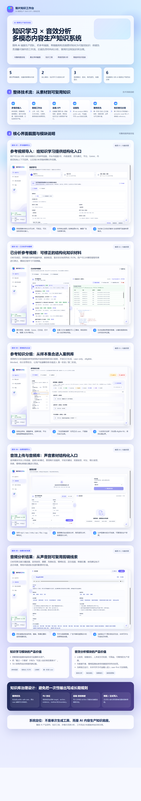

# AI 视频生产六库 Skill SOP 知识沉淀系统｜项目介绍



> 上图为系统页面截图重新排版后的总览长图：重点呈现“知识学习”和“音效分析”两个模块，并说明其在 AI 视频生产知识工程中的职责。


## 一句话介绍

这是一个面向 AI 视频 / 内容生产团队的 **case-first 六库 Skill SOP 知识沉淀工作台**。系统把真实案例、视频分析、Artist / Video JSON、创作样本与批准产物，先沉淀成 public-safe 正式案例，再通过受控分发进入可复用、可追溯、可治理的多角色知识库，支撑从创意策略到剧本、美术、分镜、剪辑和 AI 视频生成执行的协同生产。

---

## 系统解决的问题

| 问题 | 常见痛点 | 系统方案 |
| --- | --- | --- |
| 经验难复用 | 项目经验散落在聊天记录、文件和个人记忆里 | 用“案例优先”流程把经验沉淀为正式案例卡 |
| 知识容易污染 | 直接把原始数据、调试信息或具体项目细节写成通用规则 | 使用公开安全案例、知识单元协议、目标映射与原生渲染隔离工程信息 |
| 多角色边界混乱 | 制片、编剧、美术、分镜、剪辑、视频制片职责容易互相覆盖 | 建立六类角色知识库和明确的沉淀 / 分发边界 |
| 更新不可控 | 手写方法库容易变成临时补丁，难以追溯来源 | 通过 Stage1 / Stage2 分离、dry-run / apply 分离和 quality gate 控制正式知识库更新 |
| 音效资产难管理 | 音效、背景音乐、人声素材缺少结构化标签和使用建议 | 独立音频分析模块提取声音类型、情绪、节奏、适配场景和同步建议 |

---

## 核心模块

| 模块 | 功能定位 | 系统价值 |
| --- | --- | --- |
| 知识学习 | 导入参考视频、查看分析结果、修正结构化数据、按分类组织样本 | 将视频样本转成可沉淀、可追溯的知识来源 |
| 案例库沉淀 | 将来源材料整理成 public-safe 正式案例卡，并维护 CASE_INDEX | 避免把一次性观察、原始数据或调试信息直接写成长期规则 |
| 方法库分发 | 从正式案例中的 RU 知识单元，经 target contract、semantic route、native renderer 和 quality gate 写入对应 reference | 保证知识进入正确角色、正确文件、正确章节和正确原生形态 |
| 知识库预览 | 查看六库 knowledge map、case、reference preview、cleanup preview 和模板升级状态 | 让维护者在写入前理解目标库结构、可写范围和潜在风险 |
| 音效分析 | 上传、分析、筛选音效 / 角色音色 / 背景音乐，并可同步外部音频库 | 将声音素材转成可检索、可复用的生产资源 |
| 项目工程 | 从 brief 生成制片方案，并继续产出分场、视觉和分镜方案 | 将多角色知识应用到实际 AI 视频生产流程 |

---

## 系统流程

```text
输入来源
参考视频 / 本地视频 / 美术分析数据 / 视频分析数据 / 已批准项目产物 / 音频资产
  ↓
前端工作台
上传、分析、案例预览、Stage1 沉淀、Stage2 分发、知识库预览、模板升级、音频分析
  ↓
后端接口服务
登录权限、证据归一化、案例起草、目标映射、语义路由、原生渲染、质量门控
  ↓
第一阶段：正式案例优先
生成 public-safe case Markdown 与 CASE_INDEX，只写入对应角色案例库
  ↓
第二阶段：RU 知识单元受控分发
只读取正式案例中的可分发 RU，经 dry-run、target fit、section placement、native preview 和 quality gate 后写入目标 reference
  ↓
六大角色知识库
制片 / 编剧 / 美术指导 / 分镜师 / 视频剪辑 / AI 视频执行制片
  ↓
最终产出
可复用 SOP、多角色智能体知识底座、更安全的知识治理流程
```

---

## 六大角色知识库

| 角色知识库 | 负责沉淀的经验 |
| --- | --- |
| 制片 Producer | 商业目标、创意策略、主卖点、观众抓手、制作取舍、AI 可行性 |
| 编剧 Screenwriter | 故事主轴、剧本动作、对白 / 字幕 / 沉默压力、信息释放、连续性 |
| 美术指导 Art Director | 视觉目标、资产、风格、色彩、光线、材质、提示词可用字段、一致性 |
| 分镜师 Storyboard Artist | 拆镜、镜头语言、画面提示词、镜头级交接、grid / sheet / 修订证据 |
| 视频剪辑 Video Editor | 素材诊断、时间线、切点、声音 / 字幕同步、信息压缩、平台版本与剪辑修订 |
| AI 视频执行制片 Video Producer | AI 视频生成任务拆分、动作链、参考图、动态提示词、版本、风险、交接与验收边界 |

---

## 关键设计亮点

### 1. 案例优先，而不是直接写规则

系统不会把一次分析结果直接写成通用规则，而是先形成正式案例卡。案例卡保留来源证据、适用边界和不可照搬部分，再从其中抽取可分发知识单元。

### 2. RU 知识单元协议作为分发入口

每条可分发知识都必须具备目标、锚点、可观察证据、方法、有效机制、适用场景、反例和边界。这样可以避免“看起来像经验，但无法追溯或无法泛化”的内容进入方法库。

### 3. 后端固定目标映射与受控分发

目标文件和目标章节不由模型、前端或案例自己决定，而由后端 target contract、semantic route 和 section placement 决定。这样可以避免知识被写进错误角色、错误文件或文件末尾。

### 4. 原生渲染与质量门控防止污染正式知识库

第二阶段写入正式知识库时，必须转换为目标文件原生形态，例如方法原则、提示词字段规则、检查项、评分维度、模式或基准口径。正式知识库不展示来源诊断、案例路径、路由调试或原始数据；不满足 native shape、target fit 或质量门控时会进入 blocked / failed，而不是静默追加。

### 5. 知识库预览与模板升级状态

系统提供 knowledge map、reference preview、case preview、cleanup preview 和模板升级状态查看能力，让维护者在正式写入前理解当前六库结构、active target、只读范围和潜在清理风险。

### 6. 独立音频分析模块

音效 / 音频分析不混入默认知识沉淀链路，而是作为独立资源分析模块，支持音效、角色音色和背景音乐三类分析，并可同步外部音频库；后续若进入知识库，也应通过 approved artifact 与 case-first 链路。

---

## 产品能力

| 能力 | 系统体现 |
| --- | --- |
| 多模态输入 | 视频、Artist / Video JSON、结构化数据、项目产物、音频资产 |
| 工作流闭环 | 分析、案例预览、Stage1 沉淀、Stage2 分发、治理、项目生成 |
| 知识库治理 | dry-run / apply 分离、清理预览只读、target contract、native renderer、quality gate |
| 多角色协同 | 六类岗位知识边界清晰，避免单一提示词承担所有生产职责 |
| 可解释性 | 每条知识都能回到正式案例、可观察证据和适用边界 |
| 可维护性 | knowledge map、case preview、reference preview 和模板升级状态帮助维护者理解库结构 |
| 可扩展性 | 新增角色库时可沿用模板、目标映射、证据包和原生渲染机制 |

---

## 技术与实现概览

| 层级 | 说明 |
| --- | --- |
| 前端 | React / Vite 工作台，承载视频分析、案例预览编辑、Stage1 / Stage2、知识库预览、模板升级、项目工程和音频分析操作流 |
| 后端 | FastAPI 接口服务提供登录权限、上传、分析、案例库、两阶段知识沉淀、模板升级、音频资产等接口 |
| 知识结构 | 六库 SKILL、references、cases、methods、domains、prompt-library、checklists、rubric、patterns、styles、benchmarks |
| 沉淀协议 | Stage1 正式案例优先 + Stage2 RU 知识单元受控分发 |
| 治理机制 | target contract、semantic route、section placement、native renderer、quality gate、dry-run / apply 分离、清理预览只读 |
| 音频扩展 | 音效 / 音色 / 背景音乐分析，本地资产索引与外部音频库同步 |

---

## 项目价值总结

这个系统把“一次性的 AI 生成”升级为“以真实案例为入口、以六库 Skill 为底座、可持续进化的生产知识系统”。

- 对业务：复用真实项目经验，提升内容生产一致性。
- 对团队：把个人经验转成可交接、可审计、可维护的 SOP。
- 对模型：调用的不是零散提示词，而是有来源、有边界、有角色分工的知识库。
- 对产品：把复杂 AI 视频生产拆成可操作、可解释、可治理的工作台流程。

> 关键词：AI 视频生产、知识工程、Skill SOP、案例优先、多角色协同、提示词治理、内容生产工具。